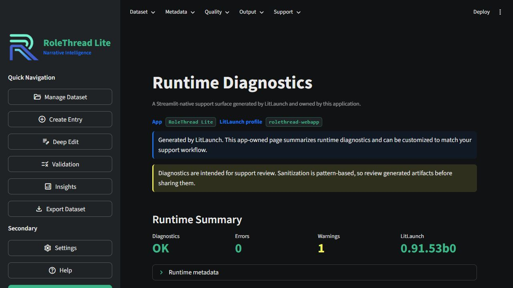
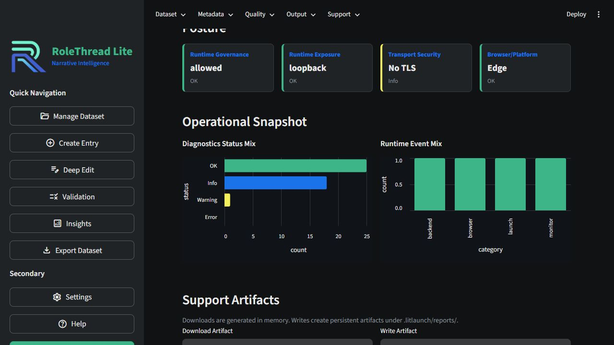
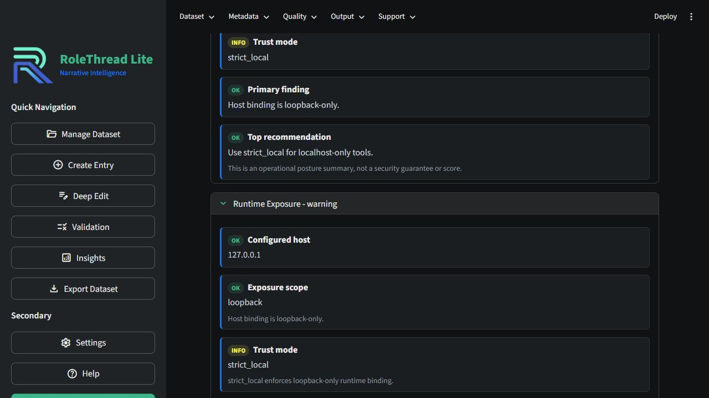

# Diagnostics Page Generator

LitLaunch can generate a Streamlit-native diagnostics/support page for host
applications. The generated file belongs to the app after it is written: you
decide where to mount it, how to style it, and whether to customize or replace
it.

LitLaunch itself does not depend on Streamlit for this feature. The generated
page imports Streamlit inside its render function so generation works even in
environments where Streamlit is not installed.

The page is meant to be a practical starting point for support workflows in
packaged local apps, internal tools, dashboards, and local-first utilities. It
collects LitLaunch runtime diagnostics, gives users a central place to create
support artifacts, and stays editable so app teams can add product-specific
support actions later.



## Generate A Page

```python
from litlaunch import create_diagnostics_page

create_diagnostics_page(
    output_path="ui/litlaunch_diagnostics.py",
    app_name="RoleThread Lite",
    profile_name="rolethread-webapp",
    theme="auto",
)
```

Or use the builder API when you want to set options explicitly:

```python
from litlaunch import DiagnosticsPageBuilder

DiagnosticsPageBuilder(
    output_path="ui/litlaunch_diagnostics.py",
    function_name="render_litlaunch_diagnostics",
    page_title="Runtime Diagnostics",
    app_name="RoleThread Lite",
    profile_name="rolethread-webapp",
    theme="dark",
    overwrite=False,
).write()
```

Then mount the generated function wherever it fits your app:

```python
from ui.litlaunch_diagnostics import render_litlaunch_diagnostics

render_litlaunch_diagnostics()
```

LitLaunch does not add the page to your navigation automatically. The host app
owns that choice because Streamlit apps organize navigation, menus, sidebars,
and support areas differently.

The generator is intentionally Python API-first because page integration is
host-app driven. Apps can call it from setup scripts, build tooling, or dev
utilities. A CLI generator can remain a future option if projects need it, but
LitLaunch does not auto-mount generated pages.

## What The Generated Page Includes

The generated page uses native Streamlit components only. It collects
diagnostics with LitLaunch's existing diagnostics APIs and renders:

- runtime summary counts and LitLaunch version
- app/profile/project metadata
- runtime governance posture
- runtime exposure posture
- transport security posture
- Streamlit-native operational snapshot charts
- platform, browser, target, and profile diagnostic sections
- in-memory downloads for HTML diagnostics, JSON diagnostics, and support bundle
- optional write buttons for `.litlaunch/reports/` artifacts
- optional recent runtime event log lines when `event_log_path` is configured



Artifacts are not written automatically on page render. The generated page only
writes files when a user clicks a write button.

This feature is not telemetry, a hosted dashboard, or a Streamlit framework.
LitLaunch only writes starter code; the host application owns the page.

## Support Workflow

The generated page works well as a Help, Support, Diagnostics, or About entry
inside a Streamlit app. It gives support users and developers one place to:

- confirm runtime governance, exposure, and transport posture
- inspect browser/platform/profile diagnostics
- download an HTML report, JSON report, or sanitized support bundle
- write persistent report artifacts under `.litlaunch/reports/`
- review recent runtime lifecycle events when an app wires an event log

That makes it useful for solo developers, small teams, packaged local apps,
and internal tools where support data often lives across logs, terminal output,
and ad hoc troubleshooting notes.

## Theme Modes

Set `theme` when generating the page:

```python
create_diagnostics_page(
    output_path="ui/litlaunch_diagnostics.py",
    app_name="RoleThread Lite",
    theme="dark",
)
```

Supported values are:

- `auto` - default and preferred; uses host-friendly Streamlit/CSS variables
  where practical.
- `dark` - LitLaunch's polished dark support-page style, used by RoleThread
  validation.
- `light` - a functional light starting point for light Streamlit apps; app
  teams may still want to tune tokens for their product theme.

The generated file includes compact `_THEME_DARK`, `_THEME_LIGHT`, and
`_THEME_AUTO` token dictionaries near the top. Because the file is app-owned,
developers can edit those tokens directly after generation. LitLaunch provides
the runtime/support foundation; final product UX remains under app ownership.

## Runtime Event Trail

If your app uses LitLaunch's `RuntimeEvent` sink to write a product log, pass
the log path when generating the page:

```python
create_diagnostics_page(
    output_path="ui/litlaunch_diagnostics.py",
    app_name="RoleThread Lite",
    profile_name="rolethread-webapp",
    event_log_path=".litlaunch/runtime-events.log",
)
```

The generated page reads recent lines from that file if it exists. LitLaunch
does not create a logging framework, rotate files, or send telemetry.



## File Safety

The generator creates parent directories as needed and refuses to replace an
existing file unless `overwrite=True` is provided. Relative output paths are
resolved from `project_root` when supplied, otherwise from the current working
directory.

The output path controls where the generated module lives. For example,
RoleThread-style apps might place it under `ui/`, while smaller apps can place
it next to `app.py` or in any package/module layout that matches their source
tree.
